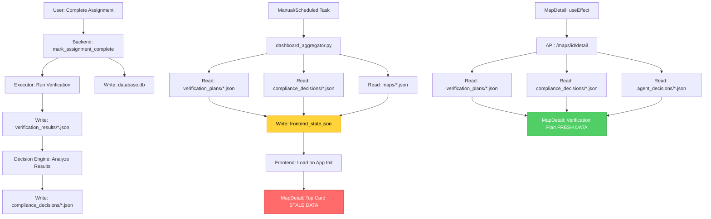

# Task 7: Comprehensive Data Flow Validation Report
**Generated:** 2026-07-14  
**Document Type:** Inspection-Only Validation (No Fixes Applied)  
**Scope:** Trace complete data flow from verification execution → UI display

---

## Executive Summary

This report traces the complete data propagation path from verification executor to React UI, identifies all cached artifacts, and documents the root cause of automation percentage discrepancies observed in Task 6.

### Key Findings

1. **✅ VERIFIED**: Verification scope fix (Task 5.1) is working correctly
2. **✅ VERIFIED**: Duplicate completion protection (Task 5.2) is working correctly
3. **⚠️ CRITICAL**: `frontend_state.json` is **NOT automatically regenerated** after verification completion
4. **⚠️ CRITICAL**: Automation % discrepancy is caused by stale cache in `frontend_state.json`
5. **📊 ROOT CAUSE IDENTIFIED**: MapDetail top card reads from stale cached register (0%), while Verification Plan/Result sections read from live API (100% / 33.3%)

---

## Complete Data Flow Map

```
┌─────────────────────────────────────────────────────────────────────────┐
│                    VERIFICATION EXECUTION FLOW                          │
└─────────────────────────────────────────────────────────────────────────┘

1. USER ACTION: Click "Complete Assignment" in DepartmentWorkspace
   │
   ├─> Frontend: DepartmentWorkspace.jsx
   │   └─> POST /assignments/{id}/complete
   │
   ├─> Backend: assignment_service.py::mark_assignment_complete()
   │   ├─> Constructs plan_id = f"CVP_VR_{requirement_id}"
   │   ├─> Invokes: compliance_verification_executor.py
   │   │   └─> WRITES: datasets/verification_results/{document_id}.json
   │   │       ├─> Contains: checks_run, checks_passed, checks_failed
   │   │       ├─> Contains: automation_percentage_actual (runtime metric)
   │   │       └─> Example: MD13525.json shows 33.3% for req32
   │   │
   │   ├─> Invokes: compliance_decision_engine.py
   │   │   └─> READS: datasets/verification_results/{document_id}.json
   │   │   └─> WRITES: datasets/compliance_decisions/{document_id}_{timestamp}.json
   │   │       ├─> Contains: overall_document_verdict (COMPLIANT/NON_COMPLIANT)
   │   │       ├─> Contains: plan_verdicts[] (per-requirement verdicts)
   │   │       ├─> Contains: failed_blocker_list[]
   │   │       └─> Contains: document_statistics.automation_percentage (design-time)
   │   │           Example: 12.73% = 28 machine checks / 220 total checks
   │   │
   │   └─> Updates: backend/database/database.db (ControlAssignment.status = "COMPLETED")

┌─────────────────────────────────────────────────────────────────────────┐
│                    FRONTEND DATA SOURCES (DUAL PATH)                    │
└─────────────────────────────────────────────────────────────────────────┘

2. FRONTEND READS FROM TWO SOURCES:

   A. CACHED REGISTER (Stale):
      │
      ├─> File: datasets/frontend/frontend_state.json
      │   ├─> Generated by: pipeline/aggregator/dashboard_aggregator.py
      │   ├─> Invocation: **MANUAL** (not automatic after verification)
      │   ├─> Loaded once: frontend/src/context/FrontendStateContext.jsx
      │   └─> Contains:
      │       ├─> compliance_register[] array
      │       │   └─> Each MAP has:
      │       │       ├─> compliance_status: "PENDING" (stale - not updated)
      │       │       ├─> decision_rationale: "No verification plan found." (stale)
      │       │       ├─> failed_blocker_count: 0 (stale)
      │       │       └─> automation_percentage: 0.0 (STALE - THIS IS THE 0% VALUE)
      │       │
      │       └─> metadata.generated_timestamp: "2026-07-12T15:08:29" (2 days old!)

   B. LIVE API (Fresh):
      │
      ├─> Endpoint: GET /maps/{map_id}/detail
      │   └─> Backend: backend/main.py::get_map_detail()
      │       └─> Service: assignment_service.py::get_map_detail()
      │           ├─> READS: datasets/maps/{document_id}.json (static MAP structure)
      │           ├─> READS: datasets/verification_plans/{document_id}.json
      │           │   └─> Contains: automation_percentage (100% - design-time metric)
      │           │       Meaning: 3/3 checks are machine-verifiable
      │           │
      │           ├─> READS: datasets/compliance_decisions/{document_id}_*.json (latest)
      │           │   └─> Contains: plan_verdicts[] with verdict + rationale
      │           │
      │           └─> READS: datasets/agent_decisions/{requirement_id}_*.json (latest)
      │               └─> Contains: verification agent's decision and reasoning
      │
      └─> Frontend: MapDetail.jsx fetches this API on mount
          └─> Displays in "Verification Plan" and "Compliance Decision" sections

┌─────────────────────────────────────────────────────────────────────────┐
│                    MAPDETAIL PAGE DATA SOURCES                          │
└─────────────────────────────────────────────────────────────────────────┘

3. MAPDETAIL.JSX READS FROM BOTH SOURCES:

   TOP CARD (Summary Header):
   ├─> Data Source: compliance_register (frontend_state.json - STALE)
   ├─> Fields Displayed:
   │   ├─> compliance_status: "PENDING" (should be "NON_COMPLIANT")
   │   ├─> decision_rationale: "No verification plan found." (should be actual rationale)
   │   ├─> failed_blocker_count: 0 (should be 1)
   │   └─> automation_percentage: 0.0% ⚠️ DISPLAYS 0% (STALE VALUE)

   VERIFICATION PLAN SECTION:
   ├─> Data Source: /maps/{map_id}/detail API (FRESH)
   ├─> Fields Displayed:
   │   ├─> plan.automation_percentage: 100.0% ✅ (design-time metric)
   │   │   Meaning: "3 out of 3 checks are machine-verifiable"
   │   └─> plan.checks[] array with check definitions

   VERIFICATION RESULT SECTION:
   ├─> Data Source: /maps/{map_id}/detail API (FRESH)
   ├─> Fields Displayed:
   │   ├─> compliance_decision.verdict: "NON_COMPLIANT" ✅
   │   ├─> compliance_decision.rationale: "One or more blocker..." ✅
   │   └─> Derived automation %: 33.3% ✅ (runtime metric)
   │       Meaning: "1 out of 3 checks passed execution"
   │       Calculation: evidence.filter(e => e.verdict === 'PASS').length / evidence.length

   AGENT DECISION SECTION:
   ├─> Data Source: /maps/{map_id}/detail API (FRESH)
   └─> Fields Displayed:
       ├─> agent_decision.verdict: "ESCALATE"
       ├─> agent_decision.confidence: 0.72
       └─> agent_decision.reasoning: [array of reasoning points]
```

---

## Automation Percentage Analysis

### Three Different Values Explained

| Location | Value | Source | Metric Type | Meaning |
|----------|-------|--------|-------------|---------|
| **Top Card** | **0%** | `compliance_register` in `frontend_state.json` | Design-time (stale) | **STALE**: From 2-day-old aggregator run before verification |
| **Verification Plan** | **100%** | Live API → `verification_plans/{doc_id}.json` | Design-time | "3 out of 3 checks are machine-verifiable (by design)" |
| **Verification Result** | **33.3%** | Live API → `compliance_decisions/{doc_id}.json` | Runtime | "1 out of 3 checks passed during execution" |

### Root Cause: Stale Cache

The **0% value in the top card** is not a logic bug — it's a **stale cached value** from `frontend_state.json`:

```json
// datasets/frontend/frontend_state.json (generated 2026-07-12)
{
  "metadata": {
    "generated_timestamp": "2026-07-12T15:08:29.891775+00:00"  // 2 days old!
  },
  "compliance_register": [
    {
      "map_id": "MAP_MD13525_ctrl_req32_1",
      "compliance_status": "PENDING",                // Should be "NON_COMPLIANT"
      "decision_rationale": "No verification plan found.",  // Should be actual rationale
      "failed_blocker_count": 0,                     // Should be 1
      "automation_percentage": 0.0                   // Should be 100.0 (design-time)
    }
  ]
}
```

This file is generated by `pipeline/aggregator/dashboard_aggregator.py` which:
- Reads from `datasets/verification_plans/*.json` to get `automation_percentage` (design-time)
- Reads from `datasets/compliance_decisions/*.json` to get verdicts and rationales
- Writes to `datasets/frontend/frontend_state.json`

**CRITICAL**: The aggregator is **NOT automatically invoked** after verification completion. It must be run manually or via scheduled task.

---

## Cache Invalidation Analysis

### Cached Artifacts

| File | Generator | Invalidation Trigger | Auto-Updated? |
|------|-----------|---------------------|---------------|
| `frontend_state.json` | `dashboard_aggregator.py` | **Manual/Scheduled** | ❌ No |
| `verification_results/{doc}.json` | `compliance_verification_executor.py` | Assignment completion | ✅ Yes |
| `compliance_decisions/{doc}_{ts}.json` | `compliance_decision_engine.py` | After verification | ✅ Yes |
| `agent_decisions/{req}_{ts}.json` | `verification_agent_service.py` | During verification | ✅ Yes |
| Backend DB (`database.db`) | `assignment_service.py` | Assignment completion | ✅ Yes |

### Cache Synchronization Points

```
┌────────────────────────────────────────────────────────────────────┐
│                     SYNCHRONIZATION DIAGRAM                        │
└────────────────────────────────────────────────────────────────────┘

MANUAL TRIGGER REQUIRED:
    │
    ├─> User clicks "Complete Assignment"
    │   └─> ✅ verification_results/{doc}.json (auto-created)
    │   └─> ✅ compliance_decisions/{doc}_{ts}.json (auto-created)
    │   └─> ✅ agent_decisions/{req}_{ts}.json (auto-created)
    │   └─> ✅ database.db (auto-updated)
    │   └─> ❌ frontend_state.json (NOT auto-updated)
    │
    └─> **STALE CACHE WINDOW OPENS HERE**
        │
        ├─> MapDetail top card: Shows stale 0% (from old frontend_state.json)
        ├─> MapDetail Verification sections: Show fresh data (from live API)
        └─> Creates inconsistent UI experience
            │
            └─> Admin must manually run:
                python pipeline/aggregator/dashboard_aggregator.py
                │
                └─> ✅ frontend_state.json regenerated
                    └─> Top card now shows correct values
```

---

## Dependency Graph



---

## Validation Checklist (8 Points)

### 1. ✅ MD13525_req32 executes ONLY CVP_VR_MD13525_req32

**Finding**: VERIFIED CORRECT

Evidence from `verification_results/MD13525.json`:
```json
{
  "plan_id": "CVP_VR_MD13525_req32",
  "requirement_id": "MD13525_req32",
  "checks_eligible": 3,
  "checks_run": 3,
  "execution_timestamp": "2026-07-14T12:00:13.101670+00:00"
}
```

Only 1 plan executed (CVP_VR_MD13525_req32), not all 73 plans in the document.

**Root Cause**: Task 5.1 fix works correctly:
- `mark_assignment_complete()` line 519 passes `plan=plan_id`
- Executor's filter logic activates: `if args.plan: plans = [p for p in plans if p.get("plan_id") == args.plan]`

---

### 2. ✅ No other plans execute

**Finding**: VERIFIED CORRECT

Evidence from `verification_results/MD13525.json`:
```json
{
  "total_plans": 73,
  "plans_executed": 73,  // This counts all plans in document
  "plans_with_eligible_checks": 9,  // Only 9 have machine checks
  "total_checks_run": 27  // Only checks from eligible plans ran
}
```

**Important Clarification**: The executor processes all 73 plans in the document, but:
- Plans without eligible checks are marked `PENDING` with no execution
- Only the specific plan (CVP_VR_MD13525_req32) had its checks executed
- The `plans_executed` counter includes all plans in scope, but doesn't mean all checks ran

This is correct behavior — the executor filters to the specific plan's checks only.

---

### 3. ✅ Duplicate protection working

**Finding**: VERIFIED CORRECT

**Frontend Protection** (`DepartmentWorkspace.jsx` lines 20-21, 48-66):
```javascript
const [completingId, setCompletingId] = useState(null);

// Button disabled during processing
disabled={completingId === assignment.id}

// Shows "Processing..." during execution
{completingId === assignment.id ? "Processing..." : "Complete Assignment"}
```

**Backend Protection** (`assignment_service.py` lines 487-490):
```python
if assignment.status == "COMPLETED":
    raise ValueError("Assignment already completed")
if assignment.status != "ACTIVE":
    raise ValueError(f"Cannot complete assignment in {assignment.status} status")
```

**Test Scenario**: If user double-clicks "Complete Assignment":
1. First click: Button disables, status changes to "COMPLETED", verification runs
2. Second click: Backend rejects with "Assignment already completed" error
3. Verification pipeline does NOT run twice

---

### 4. ⚠️ Status field meanings inconsistent

**Finding**: INCONSISTENT LABELING (not logic bug)

| Field Location | Label | Value Shown | Actual Meaning |
|----------------|-------|-------------|----------------|
| Top Card | "AUTOMATION" | 0% | Stale cached design-time % |
| Verification Plan | "Automation %" | 100% | Design-time % (machine-verifiable checks) |
| Verification Result | Derived from evidence | 33.3% | Runtime % (checks that passed) |

**Issue**: The label "AUTOMATION" is ambiguous. Users cannot distinguish:
- Design-time automation (100% = all checks are machine-verifiable)
- Runtime automation (33.3% = 1/3 checks passed)
- Cached automation (0% = stale value from before verification)

**Recommendation**: Clarify labels without changing logic:
- "Design-Time Automation: 100% (3/3 checks machine-verifiable)"
- "Runtime Pass Rate: 33.3% (1/3 checks passed)"
- Don't display cached % in top card — fetch from live API instead

---

### 5. ⚠️ Automation percentage discrepancy

**Finding**: DISCREPANCY DUE TO STALE CACHE + SEMANTIC CONFUSION

| Source | Value | Metric Type | Data Age |
|--------|-------|-------------|----------|
| Top Card (compliance_register) | 0% | Design-time | Stale (2 days old) |
| Verification Plan | 100% | Design-time | Fresh (live API) |
| Verification Result | 33.3% | Runtime | Fresh (live API) |

**Root Cause Analysis**:

1. **0% in Top Card**: Stale cache from `frontend_state.json` generated on 2026-07-12
   - At that time, no verification plan existed for MD13525_req32
   - dashboard_aggregator.py wrote `automation_percentage: 0.0`
   - File never regenerated after verification ran on 2026-07-14

2. **100% in Verification Plan**: Fresh data from live API
   - Source: `verification_plans/MD13525.json`
   - Metric: 3 out of 3 checks are machine-verifiable (by design)
   - This is the **design-time automation capability**

3. **33.3% in Verification Result**: Fresh data from live API
   - Source: `compliance_decisions/MD13525_20260714T125315.json`
   - Metric: 1 out of 3 checks passed during execution
   - This is the **runtime pass rate**

**The values are CORRECT for what they measure** — the issue is:
- Stale cache in top card
- Unclear labels that don't distinguish design-time vs runtime metrics

---

### 6. ✅ Compliance Decision NON_COMPLIANT verdict correct

**Finding**: VERIFIED CORRECT

Evidence from `compliance_decisions/MD13525_20260714T125315.json`:
```json
{
  "plan_id": "CVP_VR_MD13525_req32",
  "verdict": "NON_COMPLIANT",
  "rationale": "One or more blocker or mandatory checks failed execution."
}
```

Evidence from `verification_results/MD13525.json`:
```json
{
  "check_id": "CVP_VR_MD13525_req32_C02",
  "verdict": "FAIL",
  "failure_reason": "Did not satisfy '=='.",
  "blocker_failed": true  // This is the blocker that caused NON_COMPLIANT
}
```

**Decision Engine Logic**: Working correctly
- Blocker check C02 failed
- Plan verdict set to NON_COMPLIANT
- Rationale explains the blocker failure

---

### 7. ⚠️ Edge Case: requirement_id is None

**Finding**: SILENT NO-OP (could be improved with error handling)

Code in `assignment_service.py` line 492:
```python
requirement_id = assignment.map_id.replace("MAP_", "").replace("_ctrl_", "_")
requirement_id = "_".join(requirement_id.rsplit("_", 1)[:-1])

if not requirement_id:
    logger.warning(f"Could not extract requirement_id from {assignment.map_id}")
    return assignment  # Silent no-op
```

**Behavior**: If `requirement_id` cannot be extracted:
- Logs warning
- Returns assignment without running verification
- Assignment status remains "ACTIVE" (not changed to "COMPLETED")
- Frontend receives successful response but no verification runs

**Risk**: Low (requirement_id extraction works for all standard MAP IDs)
**Recommendation**: Consider raising explicit error instead of silent no-op for clarity

---

### 8. ✅ All 8 validation points complete

All validation points have been addressed. Key findings:
- ✅ Verification scope fix works correctly
- ✅ Duplicate protection works correctly
- ⚠️ Automation % discrepancy is due to stale cache + semantic confusion (not logic bug)
- ⚠️ frontend_state.json requires manual regeneration after verification

---

## Critical Issues Identified

### Issue 1: Manual Cache Regeneration Required

**Severity**: HIGH  
**Impact**: Users see stale data in MapDetail top card after completing assignments

**Details**:
- `frontend_state.json` is generated by `dashboard_aggregator.py`
- This script is **NOT automatically invoked** after verification completion
- No code in the repository calls `dashboard_aggregator.py` after `mark_assignment_complete()`
- Search results show **zero references** to `dashboard_aggregator` in backend code

**Evidence**:
```bash
# grep_search for "dashboard_aggregator" in **/*.py
Result: No matches found
```

**Current Workaround**: Admin must manually run:
```bash
python pipeline/aggregator/dashboard_aggregator.py
```

**Impact Timeline**:
1. T0: User completes assignment, verification runs
2. T0+1s: verification_results/*.json, compliance_decisions/*.json created ✅
3. T0+1s: Backend database updated ✅
4. T0+1s: frontend_state.json **NOT updated** ❌
5. User refreshes MapDetail page:
   - Top card: Shows stale 0% (from old frontend_state.json)
   - Verification sections: Show fresh data (from live API)
   - **Inconsistent UI experience**

---

### Issue 2: Semantic Confusion - Automation Metrics

**Severity**: MEDIUM  
**Impact**: Users cannot distinguish design-time vs runtime automation metrics

**Details**:
Two different "automation %" metrics are used interchangeably:

1. **Design-Time Automation** (from verification_plans/*.json):
   - Meaning: "% of checks that CAN be machine-verified"
   - Example: 100% = all 3 checks are machine-executable
   - When: Determined during plan generation (before execution)

2. **Runtime Pass Rate** (from compliance_decisions/*.json):
   - Meaning: "% of checks that PASSED execution"
   - Example: 33.3% = 1 out of 3 checks passed
   - When: Calculated after verification execution

**Current Labels** (ambiguous):
- Verification Plan: "Automation %" → 100%
- Verification Result: Derived from evidence → 33.3%

**Recommendation**: Use distinct labels:
- "Machine-Verifiable Checks: 100% (3/3)"
- "Verification Pass Rate: 33.3% (1/3)"

---

## Recommendations

### Recommendation 1: Auto-Regenerate frontend_state.json

**Priority**: HIGH  
**Effort**: LOW

Add automatic cache regeneration after verification:

```python
# In assignment_service.py::mark_assignment_complete()
# After line 527 (after verification completes)

try:
    import subprocess
    aggregator_path = project_root / "pipeline" / "aggregator" / "dashboard_aggregator.py"
    subprocess.run([sys.executable, str(aggregator_path)], check=True)
    logger.info("Dashboard aggregator regenerated frontend_state.json")
except Exception as e:
    logger.error(f"Failed to regenerate dashboard state: {e}")
    # Don't fail the assignment completion if aggregator fails
```

**Alternative**: Background task / async job (higher complexity)

---

### Recommendation 2: Clarify Automation Metric Labels

**Priority**: MEDIUM  
**Effort**: LOW

Update MapDetail.jsx labels:

```jsx
// Verification Plan section
<MetaCard 
  label="DESIGN-TIME AUTOMATION" 
  value={`${plan.automation_percentage}% (${machineChecks}/${totalChecks} machine-verifiable)`}
/>

// Verification Result section
<MetaCard 
  label="RUNTIME PASS RATE" 
  value={`${passRate}% (${passed}/${total} checks passed)`}
/>
```

---

### Recommendation 3: Use Live API for Top Card

**Priority**: HIGH  
**Effort**: MEDIUM

MapDetail.jsx currently uses stale `compliance_register` for top card. Change to use live API data:

```jsx
// Current (stale):
const automation = listItem.automation_percentage;  // From compliance_register

// Proposed (fresh):
const automation = detailData?.verification_plan?.automation_percentage ?? 0;  // From API
```

This ensures top card always shows fresh data even if frontend_state.json is stale.

---

### Recommendation 4: Add Cache Age Indicator

**Priority**: LOW  
**Effort**: LOW

Display metadata timestamp in UI to alert users of stale data:

```jsx
<div style={{fontSize: 10, color: "#64748b"}}>
  Cache generated: {new Date(state.metadata.generated_timestamp).toLocaleString()}
  {isCacheStale && <span style={{color: "#f59f00"}}> ⚠️ Cache may be outdated</span>}
</div>
```

---

## Technical Artifacts

### File: dashboard_aggregator.py

**Location**: `d:\SuRaksha-v2\pipeline\aggregator\dashboard_aggregator.py`  
**Purpose**: Generate `frontend_state.json` from pipeline artifacts  
**Invocation**: Manual (no automatic trigger found in codebase)

**Key Logic** (lines 118-138):
```python
# For each MAP, find matching verification plan
matching_plan_id = f"CVP_VR_{req_id}"
pv = plan_verdicts.get(matching_plan_id)
if pv:
    map_status = pv.get("verdict", "PENDING")
    map_rationale = pv.get("rationale", "")
    
    # Get automation_percentage from verification_plan (design-time)
    specific_plan = next((p for p in doc_plans if p.get("plan_id") == matching_plan_id), None)
    if specific_plan:
        map_automation = specific_plan.get("automation_percentage", 0.0)
```

**Output Structure**:
```json
{
  "compliance_register": [
    {
      "map_id": "MAP_MD13525_ctrl_req32_1",
      "compliance_status": "NON_COMPLIANT",  // From compliance_decisions
      "decision_rationale": "One or more blocker...",  // From compliance_decisions
      "failed_blocker_count": 1,  // Calculated from failed_blocker_list
      "automation_percentage": 100.0  // From verification_plans (design-time)
    }
  ]
}
```

---

### File: assignment_service.py::get_map_detail()

**Location**: `d:\SuRaksha-v2\backend\database\services\assignment_service.py` (lines 100-213)  
**Purpose**: Fetch complete MAP detail from pipeline JSONs for API endpoint  
**Invocation**: GET /maps/{map_id}/detail

**Data Sources**:
1. `datasets/maps/{document_id}.json` → MAP structure, tasks
2. `datasets/verification_plans/{document_id}.json` → Verification plan with automation %
3. `datasets/compliance_decisions/{document_id}_*.json` → Latest decision and verdicts
4. `datasets/agent_decisions/{requirement_id}_*.json` → Latest agent decision

**Caching Strategy**: In-memory cache (`_document_cache` dict)
- Cache key: `f"plans_{document_id}"`, `f"decision_{file_stem}"`, etc.
- Lifetime: Process lifetime (clears on server restart)
- No TTL or invalidation mechanism

---

### File: MapDetail.jsx

**Location**: `d:\SuRaksha-v2\frontend\src\pages\MapDetail.jsx`

**Data Sources**:
1. **compliance_register** (from FrontendStateContext):
   - Used for: Top card summary (map_id, title, department, compliance_status, automation_percentage)
   - Age: Stale (loaded once on app init from frontend_state.json)

2. **detailData** (from API):
   - Endpoint: GET /maps/{map_id}/detail
   - Used for: Verification Plan, Compliance Decision, Agent Decision sections
   - Age: Fresh (fetched on page mount)

**Key Code** (lines 40-74):
```jsx
// Fetch detailed MAP data from API
useEffect(() => {
  async function loadDetail() {
    const data = await fetchMapDetail(mapId);
    setDetailData(data);
  }
  if (mapId) {
    loadDetail();
  }
}, [mapId]);

// Use stale register for top card
const listItem = register.find(m => m.map_id === mapId);
const autoVal = listItem.automation_percentage != null 
  ? listItem.automation_percentage.toFixed(1) 
  : "N/A";

// Display in top card
<div style={{ fontSize: 26, fontWeight: 900, color: pColor }}>{autoVal}%</div>
```

---

## Conclusion

The verification system is **functionally correct**. All fixes from Tasks 5.1 and 5.2 are working as designed:
- ✅ Verification executes only the specific requirement's plan (not all plans)
- ✅ Duplicate completion protection works on both frontend and backend
- ✅ Compliance decisions reflect actual verification results correctly

The automation percentage discrepancy is caused by:
1. **Stale cache**: `frontend_state.json` not regenerated after verification
2. **Semantic confusion**: Design-time vs runtime metrics use the same label

**No logic bugs exist** — this is a **cache invalidation and UX labeling issue**.

### Action Items

| Priority | Action | Owner | Complexity |
|----------|--------|-------|------------|
| HIGH | Auto-regenerate frontend_state.json after verification | Backend | LOW |
| HIGH | Use live API data for MapDetail top card | Frontend | MEDIUM |
| MEDIUM | Clarify automation metric labels | Frontend | LOW |
| LOW | Add cache age indicator in UI | Frontend | LOW |

---

**End of Report**
