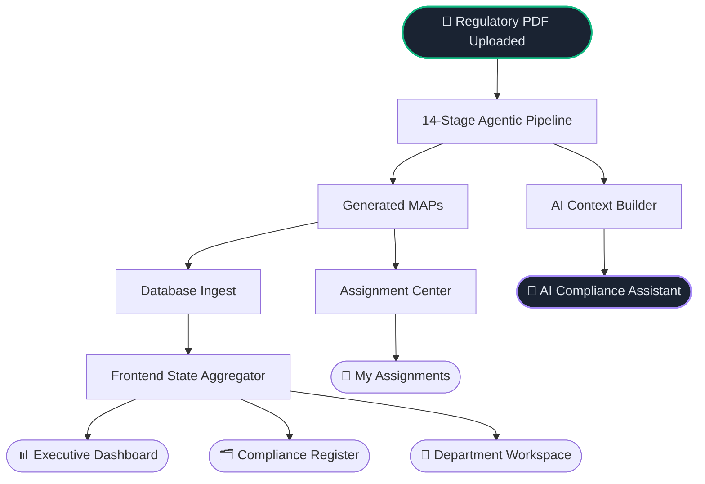

<p align="center">
  
</p>

<h1 align="center">RegIntel AI</h1>

<h3 align="center">Agentic Regulatory Compliance Intelligence for Banking</h3>

<p align="center">
  
  
  
  
  
  
</p>

<p align="center">
  <strong>Upload a regulatory circular. Get AI-generated compliance obligations. Manage execution across departments.</strong>
</p>

---

## Table of Contents

- [Problem Statement](#problem-statement)
- [Solution](#solution)
- [Key Features](#key-features)
- [System Architecture](#system-architecture)
- [Application Workflow](#application-workflow)
- [Technology Stack](#technology-stack)
- [Project Structure](#project-structure)
- [Installation](#installation)
- [Running the Project](#running-the-project)
- [Current Navigation](#current-navigation)
- [Demo Flow](#demo-flow)
- [API Reference](#api-reference)
- [User Roles & Permissions](#user-roles--permissions)
- [Future Scope](#future-scope)
- [License](#license)

---

## Problem Statement

Regulatory bodies — RBI, CERT-In, SEBI, and others — issue dozens of advisories every quarter. Each advisory must be semantically understood, decomposed into concrete action points, routed to the correct banking department, and tracked through to completion.

Today, this process is largely manual:

| Problem | Business Impact |
|---|---|
| Manual circular interpretation is slow and error-prone | Compliance cycles take weeks; sub-clauses are routinely missed |
| No structured traceability from rule to assigned task | Audit defensibility is weak; remediation is reactive |
| Obligations are siloed — no cross-department visibility | Department heads have no operational view of their regulatory load |
| Advisory volume is growing; compliance headcount is not | Backlogs compound; regulatory risk is underestimated |

---

## Solution

**RegIntel AI** automates the full intake-to-execution lifecycle for regulatory advisories.

It ingests a regulatory PDF, runs it through a 14-stage agentic pipeline, and produces **Measurable Action Points (MAPs)** — structured, department-assigned compliance obligations derived directly from the source document. These MAPs are immediately visible across the platform: in a macro Executive Dashboard, a searchable Compliance Register, a department-scoped Workspace, and an individual contributor's personal queue.

An embedded AI Compliance Assistant (powered by Ollama and Qwen3:8B) allows compliance officers to query the system in natural language. All inference runs on-premise — no regulatory data leaves the bank's infrastructure.

---

## Key Features

### 🏛️ Executive Dashboard
A macro-level operations view powered by aggregated pipeline output. Displays enterprise KPIs (total MAPs, compliance status distribution, automation profile) and a custom Sankey flow diagram visualizing the path from uploaded documents → generated MAPs → impacted departments. Includes session-level drill-down analytics.

### 🔄 AI-Powered Analysis Pipeline
Tracks document processing in real time across 14 sequential pipeline stages. Stage cards display execution duration and status, giving compliance teams full visibility into how an uploaded circular was processed.

### 📋 MAP Generation
The 14-stage agentic pipeline parses, normalizes, and semantically structures uploaded regulatory PDFs, then extracts explicit obligations and decomposes them into granular MAPs. Each MAP is traceable to its source page and requirement text.

### 🗂️ Compliance Register
The central enterprise repository for all MAPs. Supports full-text search, and filtering by department, priority, and compliance status. Columns are sortable. Each row links to a deep-detail page showing source requirement text, AI-generated rationale, and the verification plan.

### 🏢 Department Workspace
An operational command center scoped to a single department. Shows the department's regulatory impact (which source documents generated obligations), KPIs (total MAPs, critical/high priority count, automation profile), and a searchable MAP explorer filtered to that department's obligations. The active department is selectable via dropdown.

### ✅ Assignment Center
An administrator-level hub for managing organization-wide MAP approvals. Administrators review drafted MAPs, can reassign departments, and approve or reject them. Approval automatically creates trackable assignments for department personnel. Includes a live MAP status summary panel.

### 👤 My Assignments
A personal work queue for department members. Shows all assignments created for the logged-in user's department, with status tracking (Active / Completed), due dates, evidence notes, and the ability to mark assignments complete.

### 🤖 AI Compliance Assistant
A Retrieval-Augmented Generation (RAG) assistant embedded inside the Session Dashboard. Accepts natural language questions about a processed document and returns answers grounded exclusively in pipeline-generated artifacts (requirements, verification plans, compliance decisions). Powered by Ollama + Qwen3:8B running locally. Will never invent facts or fabricate compliance advice.

### 📄 Compliance Report Export
Programmatic PDF generation for any processed document. Download a structured compliance assessment report via `GET /reports/{document_id}/pdf`.

### 🔐 Role-Based Access Control
JWT-based authentication (HS256, stdlib-only — no external dependency). Seven distinct roles with granular permission scoping. Department-scoped users see only their own MAPs and assignments automatically.

---

## System Architecture



> **Privacy guarantee:** All AI inference runs locally via Ollama. No regulatory data is transmitted to external services.

---

## Application Workflow

```
1. UPLOAD
   Compliance officer uploads an RBI circular PDF via the Analysis Pipeline.
   System assigns a unique document ID (e.g., UP20260720_0001).
   Duplicate detection via SHA-256 prevents reprocessing.

        ↓

2. PIPELINE EXECUTION (background)
   Stage 1:  PDF Parser           — structural extraction
   Stage 2:  Document Normalizer  — text normalization
   Stage 3:  Hierarchy Builder    — section/clause tree
   Stage 4:  Logical Unit Builder — semantic chunking
   Stage 5:  Requirement Extractor
   Stage 6:  Requirement Enricher
   Stage 7:  Compliance Interpreter (Single Source of Truth)
   Stage 8:  Compliance Reasoning Engine
   Stage 9:  Control Deriver
   Stage 10: Verification Rule Generator
   Stage 11: Verification Planner
   Stage 12: MAP Generator        — department assignment
   Stage 13: Database Ingest
   Stage 14: Dashboard Aggregator

        ↓

3. REGISTER REVIEW
   All generated MAPs are immediately visible in the Compliance Register.
   Compliance Head filters by department, priority, and status.

        ↓

4. DEPARTMENT TRIAGE
   Each Department Head opens their Department Workspace.
   They see which source documents generated obligations for their unit
   and can explore their specific MAP obligations.

        ↓

5. APPROVAL & ASSIGNMENT
   Administrator reviews drafted MAPs in the Assignment Center.
   On approval, an assignment is automatically created for the department.

        ↓

6. EXECUTION
   Department members see their work in My Assignments.
   They review the obligation, add evidence notes, and mark complete.

        ↓

7. QUERY
   Any authorized user can query the AI Compliance Assistant
   in natural language about the document's compliance obligations.
```

---

## Technology Stack

| Layer | Technology | Notes |
|---|---|---|
| **Frontend** | React 18 + Vite | SPA, lazy-loaded routes, custom SVG charts |
| **Styling** | Vanilla CSS | CSS custom properties, no framework |
| **State** | React Context API | `FrontendStateContext`, `AuthContext`, `SessionContext` |
| **Backend** | FastAPI 0.139 (Python 3.13) | Async document processing via `BackgroundTasks` |
| **Authentication** | Custom JWT (HS256 + PBKDF2) | stdlib-only, no external auth dependency |
| **Database ORM** | SQLAlchemy 2.0 | SQLite in development, PostgreSQL-compatible |
| **AI / LLM** | Ollama + Qwen3:8B | On-premise inference, streaming responses |
| **RAG Context** | Custom `ContextBuilder` | Stage-aware artifact retrieval |
| **PDF Parsing** | lxml, BeautifulSoup4 | Regulatory document ingestion |
| **Data Processing** | pandas, numpy | Pipeline stage computations |
| **PDF Reports** | Programmatic generation | Compliance assessment PDF export |

---

## Project Structure

```text
RegIntelAI-V2/
│
├── backend/                              # FastAPI application
│   ├── main.py                           # All API endpoints
│   ├── auth.py                           # JWT (HS256 + PBKDF2, stdlib-only)
│   ├── permissions.py                    # Permission constants & role mapping
│   ├── database/
│   │   ├── models/                       # SQLAlchemy ORM models
│   │   │   ├── map.py                    # ManagementActionPlan
│   │   │   ├── control.py                # ComplianceControl
│   │   │   ├── department.py             # Department
│   │   │   ├── user.py                   # User + Role
│   │   │   ├── verification.py           # VerificationResult
│   │   │   ├── requirement.py            # Requirement
│   │   │   ├── document.py               # Document
│   │   │   └── audit.py                  # AuditLog
│   │   ├── services/                     # Business logic (AssignmentService, AuditService)
│   │   ├── init_db.py                    # Schema creation + demo seed data
│   │   └── session.py                    # DB session factory
│   ├── services/
│   │   ├── ollama_service.py             # Ollama REST wrapper (streaming)
│   │   └── context_builder.py            # Stage-aware RAG context builder
│   └── reports/
│       └── compliance_pdf_generator.py   # PDF report generation
│
├── pipeline/                             # 14-stage agentic pipeline
│   ├── acquisition/                      # Document intake & deduplication
│   ├── parser/                           # PDF parsing (lxml)
│   ├── normalizer/                       # Text normalization
│   ├── hierarchy/                        # Section/clause hierarchy builder
│   ├── logical_units/                    # Semantic chunking
│   ├── extractor/                        # Requirement extraction
│   ├── enrichment/                       # Regulatory keyword enrichment
│   ├── interpreter/                      # Compliance Interpreter (SSOT)
│   ├── reasoning/                        # Compliance Reasoning Engine
│   ├── derivation/                       # Control derivation
│   ├── verification/                     # Verification rule generation
│   ├── verification_planner/             # Verification plan generation
│   ├── map_generator/                    # MAP generation + department assignment
│   ├── executor/                         # Compliance Verification Executor
│   ├── decision/                         # Compliance Decision Engine
│   ├── aggregator/                       # Frontend state aggregation
│   └── orchestrator/                     # End-to-end pipeline orchestrator
│
├── frontend/                             # React + Vite dashboard
│   └── src/
│       ├── pages/
│       │   ├── Dashboard.jsx             # Executive Dashboard
│       │   ├── Pipeline.jsx              # Analysis Pipeline tracker
│       │   ├── SessionDashboard.jsx      # Per-document session view + AI chat
│       │   ├── Maps.jsx                  # Compliance Register
│       │   ├── MapDetail.jsx             # MAP deep-detail page
│       │   ├── DepartmentOperations.jsx  # Department Workspace
│       │   ├── AssignmentCenter.jsx      # Assignment Center (admin)
│       │   ├── MyAssignments.jsx         # My Assignments (personal queue)
│       │   ├── Login.jsx                 # Authentication
│       │   └── Graph.jsx                 # Knowledge Graph (disabled in nav)
│       ├── components/
│       │   ├── Sidebar.jsx               # Navigation
│       │   ├── Topbar.jsx                # Header with user context
│       │   ├── Breadcrumbs.jsx           # Page breadcrumbs
│       │   ├── Badges.jsx                # Priority & Status badges
│       │   ├── LoadingScreen.jsx         # Full-page loading state
│       │   ├── FullTextModal.jsx         # Text expansion modal
│       │   └── session/                  # Session-scoped sub-components
│       │       ├── ExecutiveDepartmentView.jsx  # Sankey visualization
│       │       ├── SessionKnowledgeGraph.jsx
│       │       ├── SessionMapTable.jsx
│       │       ├── SessionSummary.jsx
│       │       ├── SessionCharts.jsx
│       │       ├── PipelineStageCard.jsx
│       │       ├── DepartmentImpact.jsx
│       │       ├── VerificationSummary.jsx
│       │       └── AssignmentPreview.jsx
│       ├── context/
│       │   ├── AuthContext.jsx            # JWT token & permission helpers
│       │   ├── FrontendStateContext.jsx   # Global MAP/KPI data from pipeline
│       │   ├── SessionContext.jsx         # Per-session document data
│       │   └── TaskContext.jsx            # Background task polling
│       └── pipeline/
│           └── stages/
│               └── stageGraphBuilder.js  # Graph data transformation
│
├── datasets/                             # Pipeline artifact store
│   ├── raw/                              # Source PDFs
│   │   └── uploaded_documents/pdfs/      # User-uploaded circulars
│   ├── parsed/                           # Structured parse output
│   ├── requirements/                     # Extracted requirements
│   ├── maps/                             # Generated MAPs (JSON)
│   ├── verification_plans/               # Per-MAP verification plans
│   ├── verification_results/             # Execution evidence records
│   ├── compliance_decisions/             # Final compliance verdicts
│   ├── processed/                        # Pipeline status JSON files
│   └── frontend/                         # Aggregated frontend_state.json
│
├── docs/images/                          # Screenshots and logo
├── regintel.db                           # SQLite database
├── requirements.txt                      # Python dependencies
└── README.md
```

---

## Installation

### Prerequisites

- Python 3.13+
- Node.js 18+ and npm
- [Ollama](https://ollama.com/) installed locally
- Git

### 1. Clone the Repository

```bash
git clone https://github.com/piyushsr-0708/RegIntelAI-V2.git
cd RegIntelAI-V2
```

### 2. Backend Setup

```bash
# Create virtual environment
python -m venv .venv

# Activate — Windows
.venv\Scripts\activate

# Activate — macOS / Linux
source .venv/bin/activate

# Install dependencies
pip install -r requirements.txt
```

### 3. Database Initialisation

Creates all tables and seeds demo user accounts:

```bash
python -m backend.database.init_db
```

### 4. Frontend Setup

```bash
cd frontend
npm install
cd ..
```

### 5. Ollama Setup

```bash
# Install Ollama from https://ollama.com/, then pull the model
ollama pull qwen3:8b
```

> **Note:** Qwen3:8B requires approximately 5 GB of disk space. Inference runs on CPU if no GPU is available — a GPU will improve response speed significantly.

### 6. Environment Variables (Optional)

| Variable | Default | Purpose |
|---|---|---|
| `REGINTEL_SECRET` | `regintel-ai-offline-secret-key-v2` | JWT signing secret |

---

## Running the Project

Open **three terminal windows** from the project root.

**Terminal 1 — Backend API**
```bash
# Windows (from project root, venv active)
.venv\Scripts\python.exe -m uvicorn backend.main:app --port 8000 --reload
```
- API: `http://localhost:8000`
- Swagger docs: `http://localhost:8000/docs`

**Terminal 2 — Frontend**
```bash
cd frontend
npm run dev
```
- Dashboard: `http://localhost:5173`

**Terminal 3 — Ollama (if not running as a service)**
```bash
ollama serve
```

---

### Demo Credentials

| Username | Password | Role | Access |
|---|---|---|---|
| `admin` | `admin123` | Admin | Full platform access + document upload |
| `superadmin` | `super123` | Super Admin | Unrestricted wildcard access |
| `compliance` | `compliance123` | Compliance Head | MAP approval, pipeline, all departments |
| `risk` | `risk123` | Risk Head | Risk department MAPs & assignments |
| `audit` | `audit123` | Audit Head | Read-only, audit logs |
| `it` | `it123` | IT Head | IT department MAPs & assignments |
| `operations` | `ops123` | Operations Head | Operations department MAPs & assignments |
| `viewer` | `viewer123` | Viewer | Read-only across all departments |

---

## Current Navigation

The finalized navigation for the hackathon build:

| Route | Page | Accessible To |
|---|---|---|
| `/` | Executive Dashboard | Admin roles |
| `/pipeline` | Analysis Pipeline | All authenticated users |
| `/maps` | Compliance Register | Admin roles |
| `/departments` | Department Workspace | Admin roles |
| `/assignment-center` | Assignment Center | Users with `map:approve` |
| `/my-assignments` | My Assignments | All authenticated users |

> **Note:** The Knowledge Graph (`/graph`) and Requirement Search (`/requirements`) pages are present in the codebase but are **not exposed in the sidebar navigation** for this build. They remain accessible by direct URL.

---

## Demo Flow

Recommended sequence for hackathon judges and technical reviewers:

```
Step 1 — Login as Admin
  Credential: admin / admin123
  Shows full navigation and enterprise KPIs immediately.

       ↓

Step 2 — Executive Dashboard
  Observe macro KPIs: total MAPs, compliance status, automation %.
  Click the Sankey chart to see document → MAP → department flow.
  Click a session card to drill into a specific circular.

       ↓

Step 3 — Session Dashboard (from pipeline)
  Review pipeline stage cards with per-stage execution timings.
  See the AI-generated session summary (MAP count, dept coverage, automation %).
  Ask the AI Compliance Assistant a question about the document's obligations.

       ↓

Step 4 — Compliance Register
  Browse and search all generated MAPs.
  Apply filters: department, priority, status.
  Click a MAP row to open its deep-detail page (source text, rationale, verification plan).

       ↓

Step 5 — Department Workspace
  Select a department (e.g., IT) from the dropdown.
  Review which source documents impact that department.
  Explore the filtered MAP list for that department.

       ↓

Step 6 — Assignment Center (admin view)
  Review drafted MAPs awaiting approval.
  Demonstrate approve/reject workflow.

       ↓

Step 7 — My Assignments (department view)
  Switch to a department user (e.g., it / it123).
  Show the personal assignment queue with status tracking.
```

---

## API Reference

Full interactive documentation: `http://localhost:8000/docs`

| Method | Endpoint | Description | Permission |
|---|---|---|---|
| `POST` | `/auth/login` | Obtain JWT access token | Public |
| `GET` | `/auth/me` | Get current user profile | Authenticated |
| `POST` | `/documents/upload` | Upload regulatory PDF for processing | `doc:upload` |
| `GET` | `/documents/{id}/status` | Poll pipeline progress | `map:read` |
| `GET` | `/documents/{id}/session` | Full session data for a processed document | `map:read` |
| `GET` | `/maps` | List all MAPs (paginated, filterable) | `map:read` |
| `GET` | `/maps/{id}` | MAP detail | `map:read` |
| `GET` | `/maps/{id}/detail` | Extended MAP detail with pipeline artifacts | `map:read` |
| `PATCH` | `/maps/{id}` | Update MAP metadata (priority, department, notes) | `map:write` |
| `POST` | `/maps/{id}/approve` | Approve MAP and create assignment | `map:approve` |
| `POST` | `/maps/{id}/reject` | Reject MAP with reason | `map:approve` |
| `GET` | `/maps/stats/summary` | MAP status counts by state | `map:read` |
| `GET` | `/assignments` | List assignments (dept-scoped for non-admins) | `assign:read` |
| `PATCH` | `/assignments/{id}` | Mark assignment complete with evidence note | `assign:complete` |
| `GET` | `/assignments/stats/summary` | Assignment status counts | `assign:read` |
| `GET` | `/departments` | List all departments | `dept:read` |
| `GET` | `/users` | List all users | `user:read` |
| `GET` | `/audit` | Recent audit log entries | `audit:read` |
| `GET` | `/audit/{type}/{id}` | Audit trail for a specific entity | `audit:read` |
| `GET` | `/chat/health` | Check Ollama availability | Public |
| `POST` | `/chat` | Query the AI Compliance Assistant | `map:read` |
| `GET` | `/reports/{id}/pdf` | Download compliance assessment PDF | `map:read` |

---

## User Roles & Permissions

| Role | Upload Docs | Approve MAPs | View All | Edit MAPs | Complete Assignments |
|---|---|---|---|---|---|
| Super Admin | ✅ | ✅ | ✅ | ✅ | ✅ |
| Admin | ✅ | ✅ | ✅ | ✅ | — |
| Compliance Head | ✅ | ✅ | ✅ | ✅ | ✅ |
| Risk Head | — | — | Own dept | — | ✅ |
| Audit Head | — | — | ✅ | — | — |
| IT Head | — | — | Own dept | — | ✅ |
| Operations Head | — | — | Own dept | — | ✅ |
| Viewer | — | — | ✅ | — | — |

---

## Future Scope

The following items are explicitly **not implemented** in the current build and are planned for future development:

- **Server-side pagination for all tables** — current tables use client-side slice/filter over the loaded dataset
- **Evidence file upload** — assignment completion currently accepts text notes only
- **Formal attestation workflow** — digital sign-off by Department Heads
- **Advanced multi-select column filters** — current Compliance Register has single-value dropdowns
- **Enterprise SSO** — Azure AD / Okta integration (current auth is standalone JWT)
- **Knowledge Graph re-enablement** — the Graph page exists but is disabled from navigation
- **Scheduled re-verification** — automated periodic compliance re-checks
- **Delta analysis** — detecting changes between two versions of the same circular
- **WebSocket/SSE pipeline streaming** — current implementation uses client-side polling

---

## License

```
MIT License

Copyright (c) 2026 RegIntel AI

Permission is hereby granted, free of charge, to any person obtaining a copy
of this software and associated documentation files (the "Software"), to deal
in the Software without restriction, including without limitation the rights
to use, copy, modify, merge, publish, distribute, sublicense, and/or sell
copies of the Software, and to permit persons to whom the Software is
furnished to do so, subject to the following conditions:

The above copyright notice and this permission notice shall be included in all
copies or substantial portions of the Software.

THE SOFTWARE IS PROVIDED "AS IS", WITHOUT WARRANTY OF ANY KIND, EXPRESS OR
IMPLIED, INCLUDING BUT NOT LIMITED TO THE WARRANTIES OF MERCHANTABILITY,
FITNESS FOR A PARTICULAR PURPOSE AND NONINFRINGEMENT. IN NO EVENT SHALL THE
AUTHORS OR COPYRIGHT HOLDERS BE LIABLE FOR ANY CLAIM, DAMAGES OR OTHER
LIABILITY, WHETHER IN AN ACTION OF CONTRACT, TORT OR OTHERWISE, ARISING FROM,
OUT OF OR IN CONNECTION WITH THE SOFTWARE OR THE USE OR OTHER DEALINGS IN THE
SOFTWARE.
```

---

<p align="center">
  Built for the <strong>Canara Bank SuRaksha Hackathon</strong> &nbsp;·&nbsp;
  <a href="http://localhost:8000/docs">API Docs</a> &nbsp;·&nbsp;
  <a href="http://localhost:5173">Dashboard</a>
</p>
