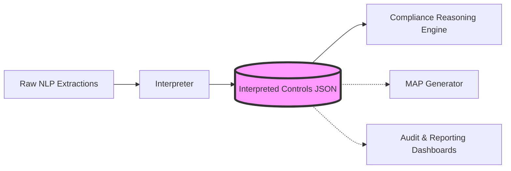
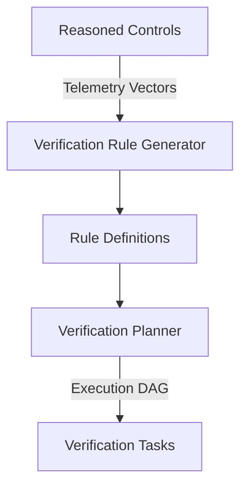

# RegIntel AI

<div align="center">
  
  
  
  
</div>

## 🚀 Project Overview

### Problem Statement
Modern banking compliance is a manual, error-prone translation process. When regulators (such as the Reserve Bank of India) issue complex Master Directions, compliance teams spend thousands of hours manually parsing text, deriving controls, building verification checklists, and delegating mitigation tasks. This semantic gap between theoretical regulatory text and physical banking operations results in high compliance turnaround times, delayed implementations, and increased exposure to regulatory penalties.

### Solution Overview
**RegIntel AI** is an enterprise-grade agentic compliance intelligence platform. It bridges the semantic gap by ingesting raw regulatory documents and autonomously translating them into actionable, verifiable banking telemetry. It does not just parse text; it understands the banking domain—mapping abstract requirements to specific banking systems (Core Banking, SIEM, Treasury Management) and formulating precise evidence extraction hypotheses.

### Business Value
- **Accelerated Compliance TAT:** Reduces the time to interpret and action a new Master Direction from weeks to minutes.
- **Zero-Touch Verification Foundations:** Transforms vague policy requirements into deterministic system queries (e.g., SQL against CBS, API calls to Active Directory).
- **Audit Defensibility:** Maintains unbroken cryptographic provenance from a generated compliance task back to the specific line in the original PDF.

---

## ✨ Key Features & Innovations

- **Deep Semantic Banking Ontology:** Unlike generic RegTech solutions that rely on keyword matching, RegIntel AI infers operational reality. It understands that a requirement regarding "Cross-border limits" maps to the Treasury Management System (TMS) and requires Database Records as evidence.
- **Immutable Provenance:** Every derived control maintains a strict mapping to its origin (`document_id`, `logical_unit_id`, `page_numbers`, `block_ids`).
- **Deterministic AI Execution:** Utilizes robust ontological mapping matrices to ensure that reasoning is reproducible and hallucination-free, making it suitable for enterprise banking environments.

---

## 🏗️ Architecture & Design Philosophy

### Overall Pipeline Architecture

```mermaid
graph TD
    A[Acquisition] --> B[PDF Parser]
    B --> C[Normalizer]
    C --> D[Hierarchy Builder]
    D --> E[Logical Unit Builder]
    E --> F[Requirement Extractor]
    F --> G[Requirement Enricher]
    G --> H[Compliance Control Deriver]
    H --> I[Compliance Interpreter <br/>(SSOT)]
    I --> J[Compliance Reasoning Engine <br/>(Semantic Inference)]
    J --> K[Verification Rule Generator]
    K --> L[Verification Planner]
    L --> M[Compliance Verification Executor]
    M -.-> N[Compliance Decision Engine]
    
    style J fill:#d4edda,stroke:#28a745,stroke-width:2px
    style K fill:#d4edda,stroke:#28a745,stroke-width:2px
    style L fill:#d4edda,stroke:#28a745,stroke-width:2px
    style M fill:#d4edda,stroke:#28a745,stroke-width:2px
    style N fill:#f8d7da,stroke:#dc3545,stroke-dasharray: 5 5
```
*(Green indicates the current boundary of Phase 1 completion. Red dashed lines indicate planned downstream modules).*

### Design Principles
1. **Modularity:** The pipeline is strictly decoupled. Each module performs a single transformation and outputs structured JSON.
2. **Explainability Over Magic:** We prioritize deterministic ontological mapping for reasoning over opaque end-to-end LLM generation. 
3. **Graceful Degradation:** If the system cannot confidently map a control to machine-readable telemetry, it degrades to a `LOW_HUMAN_ATTESTED` workflow rather than hallucinating an impossible API call.

### The Single Source of Truth (SSOT) Architecture



**Why is the Compliance Interpreter the SSOT?**
In enterprise systems, upstream NLP/LLM layers (Extractors and Enrichers) are inherently stochastic. If downstream agents queried raw NLP outputs dynamically, the platform's state would drift. The **Compliance Interpreter** standardizes and freezes these raw extractions into an immutable, deterministic JSON schema. This file becomes the Single Source of Truth for the entire enterprise.

---

## 🧠 The Intelligence Pipeline

RegIntel AI operates through a series of discrete, stateful transformations:

1. **Acquisition to Logical Units:** Raw PDFs are parsed, normalized, and semantically chunked into coherent logical units (preserving hierarchy and block IDs).
2. **Extraction to Derivation:** AI models extract obligations, enrich them with regulatory keywords, and derive actionable compliance controls.
3. **Compliance Interpreter:** Normalizes the derived controls into a rigid schema, resolving ambiguities and establishing the SSOT.
4. **Compliance Reasoning Engine (CRE):** The cognitive core of the platform.

### Why the CRE is Layered *On Top* of the Interpreter
Instead of replacing the Interpreter, the CRE acts as a specialized semantic inference layer. The Interpreter's job is **syntactic normalization** (standardizing what the regulation *says*). The CRE's job is **operational inference** (determining what the regulation *means* for the bank's IT systems). By keeping them separate, we preserve the pure regulatory interpretation in the SSOT while allowing the CRE to evolve rapidly with new banking system ontologies without corrupting the base data.

**The CRE Pipeline:**
`Requirement` → `Regulatory Intent` → `Compliance Capability` → `Business Process` → `Evidence Hypothesis` → `Evidence Trust Assessment` → `Telemetry Vector` → `Autonomy Assessment`.

---

### Compliance Verification Executor

The **Compliance Verification Executor (CVE)** is the execution engine that validates compliance by directly interrogating system state.

- **Inputs:** VerificationPlan JSONs (produced by the Verification Planner).
- **Processing:** 
  - Safely filters and executes *only* machine-verifiable checks.
  - Supports CMD, PowerShell, and SQL command types.
- **Safety Guarantees:**
  - **Read-only Execution:** Commands are strictly non-mutating (e.g., SQL SELECT only).
  - **Configurable Timeouts:** Default 5-second hard timeout per check.
  - **Unsupported Command Skipping:** Enterprise infrastructure commands (Active Directory, CBS, TMS) are instantly classified and skipped (SKIPPED_ENVIRONMENT_UNAVAILABLE) if unavailable locally.
- **Outputs:** VerificationResult JSONs detailing execution logs, evidence records, and check verdicts (PASS, FAIL, ERROR, SKIPPED).

## 📊 Dataset & Performance

- **Corpus:** 354 RBI Master Directions.
- **Scale:** Generated **~59,000** Reasoned Compliance Controls.
- **Semantic Distribution:** The CRE successfully mapped over 45,000 controls to specific banking workflows, identifying 2,300+ targets for highly immutable, machine-verifiable telemetry (e.g., CBS, SIEM, API Gateways) and eliminating generic fallbacks.

---

## 💻 Getting Started

### Prerequisites
- Python 3.13+
- Git

### Installation
```bash
git clone https://github.com/piyushsr-0708/RegIntelAI-V2.git
cd RegIntelAI-V2
python -m venv .venv
source .venv/bin/activate  # Or `.venv\Scripts\activate` on Windows
pip install -r requirements.txt
```

### Usage
Execute the pipeline stages sequentially. (Assuming upstream JSONs are populated in `/datasets`):

```bash
# Run the Compliance Interpreter to establish the SSOT
python -m pipeline.interpreter.compliance_interpreter

# Run the Compliance Reasoning Engine to generate execution telemetry
python -m pipeline.reasoning.compliance_reasoning_engine
```

Outputs will be generated in `datasets/interpreted_controls/` and `datasets/reasoned_controls/`.

---

## 🗂️ Repository Structure

```text
RegIntelAI-V2/
├── datasets/
│   ├── interpreted_controls/      # SSOT JSON files
│   ├── reasoned_controls/         # CRE output with telemetry vectors
│   └── (upstream_data_folders)
├── logs/                          # Execution logs
├── pipeline/
│   ├── interpreter/               # Compliance Interpreter module
│   ├── reasoning/                 # Compliance Reasoning Engine
│   └── (upstream_modules)
├── .gitignore
├── README.md
└── requirements.txt
```

---

## 🛣️ Current Status & Agentic Roadmap

**Current Status:** Phase 1 is complete. The pipeline successfully ingests RBI documents and processes them through the Compliance Reasoning Engine. The system now possesses the semantic intelligence required to identify exactly *which* banking system holds the evidence for *which* regulation.

### Planned: The Verification Pipeline



### Planned: Autonomous Execution Pipeline

```mermaid
graph TD
    A[Execution DAG] --> B[Evidence Collection Agent]
    B --> C{Trust Assessment}
    C -->|HIGH_IMMUTABLE| D[Target System <br/>(CBS, SIEM, AD)]
    C -->|LOW_HUMAN| E[Human Attestation <br/>(Jira/Workflow)]
    D --> F[(Evidence Vault)]
    E --> F
    F --> G[Compliance Status Agent]
    G --> H[Executive Dashboard]
```

---

## 🛠️ Technologies Used

- **Language:** Python 3.13
- **Data Serialization:** JSON (Schema-driven)
- **Execution Tracking:** `tqdm`, standard `logging`
- **Architecture Pattern:** Data-driven, decoupled micro-pipeline

---

## 🤝 Contributors & License

**License:** MIT License

**Team:**
Built for the Canara Bank SuRaksha Hackathon.
