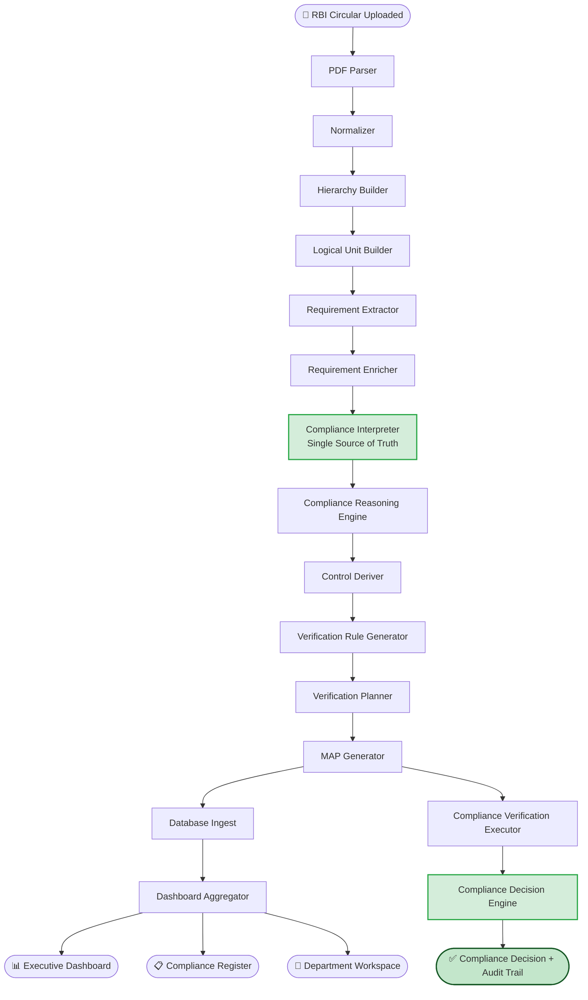
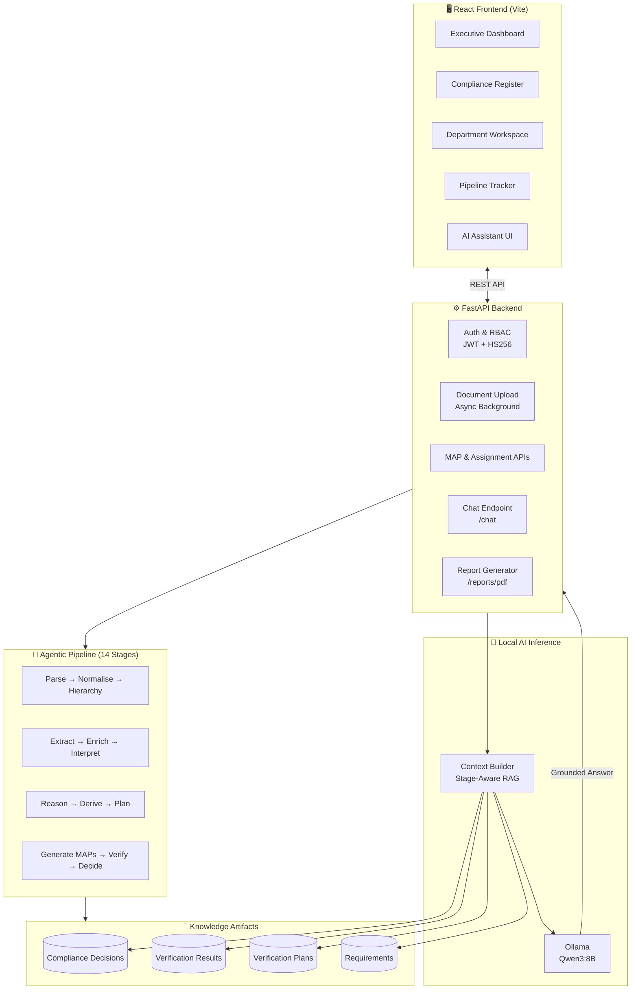

<p align="center">
  
</p>

<h1 align="center">RegIntel AI</h1>

<h3 align="center">Agentic Regulatory Compliance Intelligence for Banking</h3>

<p align="center">
  
  
  
  
  
  
</p>

<p align="center">
  <strong>Upload a regulatory circular. Get independently verified compliance decisions. Ask questions in plain English.</strong>
</p>

---

## Table of Contents

- [Overview](#overview)
- [Why It Matters](#why-it-matters)
- [Features](#features)
- [End-to-End Workflow](#end-to-end-workflow)
- [System Architecture](#system-architecture)
- [AI Compliance Assistant](#ai-compliance-assistant)
- [Tech Stack](#tech-stack)
- [Project Structure](#project-structure)
- [Screenshots](#screenshots)
- [Installation](#installation)
- [Running the Project](#running-the-project)
- [Demo Walkthrough](#demo-walkthrough)
- [API Reference](#api-reference)
- [User Roles & Permissions](#user-roles--permissions)
- [Future Roadmap](#future-roadmap)
- [Contributors](#contributors)
- [License](#license)

---

## Overview

Regulatory bodies — RBI, CERT-In, SEBI, and others — issue dozens of advisories every quarter. Each advisory must be semantically understood, decomposed into concrete action points, routed to the correct department, and — critically — independently verified against actual banking systems before a bank can declare itself compliant.

**RegIntel AI** automates this entire lifecycle end to end.

It ingests a regulatory PDF, runs it through a 14-stage agentic pipeline, assigns Measurable Action Points (MAPs) to departments, generates and executes verification plans against live systems, and issues an audit-grade compliance decision — traceable back to the exact clause in the source document.

A built-in AI Compliance Assistant (RegulAI1 Mitra) lets compliance officers query the system in natural language, receiving answers grounded exclusively in the pipeline's verified evidence.

---

## Why It Matters

> [!IMPORTANT]
> The hardest requirement in regulatory compliance is **independent verification** — verifying that departments are actually compliant, not just self-reporting it. RegIntel AI is built around this constraint.

| Problem | Impact |
|---|---|
| Manual circular interpretation is slow and error-prone | Compliance cycles take weeks; sub-clauses are routinely missed |
| Department self-attestation is the industry norm | Non-compliance is hidden until an audit exposes it |
| No structured traceability from rule to evidence | Audit defensibility is weak; remediation is slow |
| Advisory volume is growing; compliance headcount is not | Backlogs accumulate; regulatory risk compounds |
| Verification is never done against source systems | Banks confirm compliance on paper while systems remain exposed |

RegIntel AI addresses each of these failure modes with an automated, independently verified, and fully traceable compliance workflow.

---

## Features

### 🔄 Regulatory Advisory Ingestion
Upload any RBI or regulatory circular as a PDF. The system assigns a unique, human-readable document ID (`UP20260720_0001`) and immediately queues it for background processing. Duplicate detection via SHA-256 prevents reprocessing.

### 🧠 Semantic Decomposition into MAPs
The 14-stage agentic pipeline parses, normalises, and hierarchically structures the document, then extracts explicit regulatory obligations and decomposes them into granular **Measurable Action Points (MAPs)** — each traceable to its source page and block.

### 🏦 Automated Department Assignment
Each MAP is routed to the responsible banking department (IT Security, Risk, Treasury, Operations, etc.) based on an ontological compliance mapping that understands which controls belong to which system.

### 📋 Verification Planning
For every MAP, the system auto-generates a structured verification plan — a set of machine-readable checks specifying exactly what evidence is required and how to collect it.

### 🔍 Independent Compliance Verification
The Compliance Verification Executor runs each verification plan directly against available systems using read-only commands (SQL `SELECT`, PowerShell queries, CMD). It does not rely on department confirmation. Each check returns a verifiable verdict: `PASS`, `FAIL`, `ERROR`, or `SKIPPED_ENVIRONMENT_UNAVAILABLE`.

### ⚖️ Compliance Decision Engine
A deterministic rule engine (not an LLM) aggregates check verdicts into a per-MAP and document-level compliance verdict with structured rationale. Decisions are reproducible and audit-grade.

### 🤖 AI Compliance Assistant (RegulAI1 Mitra)
A stage-aware, locally running AI assistant powered by Ollama and Qwen3:8B. Answers compliance questions in natural language, grounded exclusively in pipeline-generated evidence. No data leaves the bank's infrastructure.

### 📊 Executive Dashboard & Compliance Register
A React frontend with role-based views: Executive Dashboard (KPIs, department status), Compliance Register (MAP-level detail, verification results, decisions), and Department Workspace (assigned MAPs, evidence submission).

### 📄 Compliance Report Export
Programmatic PDF generation — download a structured compliance assessment report for any processed document.

---

## End-to-End Workflow



---

## System Architecture



> [!NOTE]
> All AI inference runs locally via Ollama. No regulatory data is transmitted to external services.

---

## AI Compliance Assistant

**RegulAI1 Mitra** is a stage-aware Retrieval-Augmented Generation (RAG) assistant embedded in the platform.

### Stage-Aware Retrieval

The assistant automatically selects the right evidence source based on where the document is in the pipeline:

| Stage | Context Sources | Example Answer |
|---|---|---|
| **Pre-Verification** | Verification Plans + Requirements | "The VAPT plan requires a bi-annual vulnerability scan of critical systems." |
| **Post-Verification** | Compliance Decisions + Verification Results | "MAP CVP-001 is NON_COMPLIANT. The scan evidence check returned FAIL — no completed scan found within the required 6-month window." |

### Design Principles

- `temperature: 0.1` — near-deterministic, grounded responses
- `think: False` — disables Qwen3 chain-of-thought for faster factual retrieval
- Streaming response — avoids socket timeouts on CPU-only hardware
- Context budget: 3,000 characters — aggressive summarisation keeps prefill fast on local hardware
- System prompt enforces: *never invent facts, never fabricate compliance advice*

> [!CAUTION]
> The assistant will explicitly state when information is unavailable rather than generating a plausible-sounding but unverified answer.

---

## Tech Stack

| Layer | Technology | Purpose |
|---|---|---|
| **Backend** | FastAPI (Python 3.13) | REST API, async document processing |
| **Authentication** | Custom JWT (HS256 + PBKDF2) | Offline-capable, no external auth dependency |
| **Database ORM** | SQLAlchemy | Database abstraction (SQLite in dev, PostgreSQL-ready) |
| **Frontend** | React + Vite | Dashboard, register, workspace, assistant UI |
| **Local AI** | Ollama + Qwen3:8B | On-premise LLM inference, no external API |
| **Pipeline** | Python (modular, JSON-driven) | 14-stage agentic compliance pipeline |
| **PDF Parsing** | lxml, BeautifulSoup4 | Regulatory document ingestion |
| **Data Processing** | pandas, numpy | Dataset processing during pipeline stages |
| **PDF Reports** | Programmatic generation | Compliance assessment PDF export |
| **Package Management** | pip + venv | Python dependency isolation |

---

## Project Structure

```text
RegIntelAI-V2/
│
├── backend/                         # FastAPI application
│   ├── main.py                      # All API endpoints (auth, maps, upload, chat, reports)
│   ├── auth.py                      # JWT auth + PBKDF2 password hashing
│   ├── permissions.py               # Role-based permission constants
│   ├── database/
│   │   ├── models/                  # SQLAlchemy ORM models
│   │   │   ├── map.py               # ManagementActionPlan
│   │   │   ├── control.py           # ComplianceControl
│   │   │   ├── department.py        # Department
│   │   │   ├── user.py              # User + Role
│   │   │   ├── verification.py      # VerificationResult
│   │   │   └── ...
│   │   ├── services/                # Business logic services
│   │   └── session.py               # DB session management
│   ├── services/
│   │   ├── ollama_service.py        # Ollama REST API wrapper (streaming)
│   │   └── context_builder.py       # Stage-aware RAG context builder
│   └── reports/
│       └── compliance_pdf_generator.py
│
├── pipeline/                        # 14-stage agentic pipeline
│   ├── acquisition/                 # Document intake
│   ├── parser/                      # PDF parsing
│   ├── normalizer/                  # Text normalisation
│   ├── hierarchy/                   # Section/clause hierarchy
│   ├── logical_units/               # Semantic chunking
│   ├── extractor/                   # Requirement extraction
│   ├── enrichment/                  # Regulatory keyword enrichment
│   ├── interpreter/                 # Compliance interpreter (SSOT)
│   ├── reasoning/                   # Compliance Reasoning Engine
│   ├── derivation/                  # Control derivation
│   ├── verification/                # Verification rule generation + execution
│   ├── verification_planner/        # Verification plan generation
│   ├── map_generator/               # MAP generation + department assignment
│   ├── decision/                    # Compliance Decision Engine
│   ├── aggregator/                  # Dashboard state aggregation
│   └── orchestrator/                # End-to-end pipeline orchestrator
│
├── frontend/                        # React + Vite dashboard
│   └── src/
│       ├── pages/
│       │   ├── Dashboard.jsx        # Executive KPI dashboard
│       │   ├── Maps.jsx             # Compliance register
│       │   ├── MapDetail.jsx        # MAP detail with verification + decision
│       │   ├── DepartmentWorkspace.jsx
│       │   ├── Pipeline.jsx         # Session pipeline tracker
│       │   ├── SessionDashboard.jsx
│       │   ├── AssignmentCenter.jsx
│       │   ├── Requirements.jsx
│       │   └── Login.jsx
│       └── components/
│           ├── Sidebar.jsx
│           ├── Topbar.jsx
│           └── ...
│
├── datasets/                        # Pipeline artifact store
│   ├── raw/                         # Source PDFs (master_directions + uploaded_documents)
│   ├── parsed/                      # Structured parse outputs
│   ├── requirements/                # Extracted regulatory requirements
│   ├── maps/                        # Generated MAPs
│   ├── verification_plans/          # Per-control verification plans
│   ├── verification_results/        # Execution evidence records
│   ├── compliance_decisions/        # Final compliance verdicts
│   └── frontend/                    # Aggregated frontend state JSON
│
├── docs/
│   └── images/                      # Screenshots and diagrams
│
├── regintel.db                      # SQLite database (dev)
├── requirements.txt
└── README.md
```

---

## Screenshots

### Executive Dashboard

<p align="center">
  
</p>

*KPI summary: total MAPs, compliance percentage, department-level status, document inventory.*

---

### Session Pipeline Tracker

<p align="center">
  
</p>

*Real-time stage-by-stage progress for a newly uploaded circular, from PDF parsing through compliance decisioning.*

---

### MAP Generation & Compliance Register

<p align="center">
  
</p>

*Measurable Action Points derived from the circular, with department assignment, priority, and compliance status.*

---

### MAP Detail — Verification & Decision

<p align="center">
  
</p>

*Full MAP detail: source requirement text, verification plan, per-check evidence, and final compliance decision with rationale.*

---

### AI Compliance Assistant

<p align="center">
  
</p>

*RegulAI1 Mitra answering compliance questions grounded in verified pipeline evidence.*

---

### Compliance Verification

<p align="center">
  
</p>

*Verification execution results: per-check verdicts (PASS / FAIL / SKIPPED), raw evidence, and overall plan status.*

---

### Compliance Decisions

<p align="center">
  
</p>

*Document-level compliance verdict with structured rationale, compliance percentage, and failed-blocker list.*

---

### Department Workspace

<p align="center">
  
</p>

*Department-scoped view: assigned MAPs, due dates, evidence notes, and per-assignment status tracking.*

---

## Installation

### Prerequisites

- Python 3.13+
- Node.js 18+ and npm
- [Ollama](https://ollama.com/) installed and running locally
- Git

---

### 1. Clone the Repository

```bash
git clone https://github.com/piyushsr-0708/RegIntelAI-V2.git
cd RegIntelAI-V2
```

### 2. Backend Setup

```bash
# Create and activate virtual environment
python -m venv .venv

# Windows
.venv\Scripts\activate

# macOS / Linux
source .venv/bin/activate

# Install dependencies
pip install -r requirements.txt
```

### 3. Database Initialisation

```bash
python -m backend.database.init_db
```

### 4. Frontend Setup

```bash
cd frontend
npm install
cd ..
```

### 5. Ollama Setup

```bash
# Install Ollama from https://ollama.com/
# Then pull the required model
ollama pull qwen3:8b
```

> [!TIP]
> Qwen3:8B requires approximately 5GB of disk space. The model runs on CPU; a GPU will significantly improve inference speed.

---

## Running the Project

Open three terminal windows from the project root.

**Terminal 1 — Backend API**
```bash
.venv\Scripts\python.exe -m uvicorn backend.main:app --port 8000 --reload
```
API available at: `http://localhost:8000`
Swagger UI: `http://localhost:8000/docs`

**Terminal 2 — Frontend**
```bash
cd frontend
npm run dev
```
Dashboard available at: `http://localhost:5173`

**Terminal 3 — Ollama (if not running as a service)**
```bash
ollama serve
```

### Demo Credentials

| Username | Password | Role |
|---|---|---|
| `admin` | `admin123` | Admin (full access) |
| `compliance` | `compliance123` | Compliance Head |
| `it` | `it123` | IT Security Department |
| `risk` | `risk123` | Risk Department |
| `treasury` | `treasury123` | Treasury Department |
| `audit` | `audit123` | Auditor (read-only) |

---

## Demo Walkthrough

The following sequence demonstrates the complete compliance lifecycle on a new regulatory circular.

```
Step 1 — Upload Circular
  POST /documents/upload  ←  RBI circular PDF
  System assigns document ID: UP20260720_0001
  14-stage pipeline queued in background

       ↓

Step 2 — Pipeline Executes (background)
  PDF Parser → Normalizer → Hierarchy Builder
  → Requirement Extractor → Compliance Interpreter (SSOT)
  → Compliance Reasoning Engine → Verification Planner
  → MAP Generator → Database Ingest → Dashboard Aggregator

       ↓

Step 3 — Review MAPs
  Dashboard → Compliance Register
  Each MAP shows: control name, department, priority, verification status

       ↓

Step 4 — View Verification Results
  Click any MAP → MAP Detail
  See: source requirement (with page reference) + verification checks + verdict

       ↓

Step 5 — Review Compliance Decision
  Decision Engine verdict: COMPLIANT / NON_COMPLIANT / PARTIALLY_COMPLIANT
  Structured rationale traceable to specific failed checks

       ↓

Step 6 — Ask the AI Assistant
  Question: "What are the key compliance gaps for this document?"
  RegulAI1 Mitra answers from verified compliance decisions + evidence
  (No hallucination — answers are grounded in pipeline artifacts only)

       ↓

Step 7 — Export Report
  GET /reports/{document_id}/pdf
  Download structured compliance assessment PDF
```

---

## API Reference

Key endpoints — full documentation at `http://localhost:8000/docs`.

| Method | Endpoint | Description | Auth Required |
|---|---|---|---|
| `POST` | `/auth/login` | Obtain JWT access token | No |
| `POST` | `/documents/upload` | Upload RBI circular PDF | `DOC_UPLOAD` |
| `GET` | `/documents/{id}/status` | Poll pipeline progress | `MAP_READ` |
| `GET` | `/documents/{id}` | Full document session data | `MAP_READ` |
| `GET` | `/maps` | List all MAPs (paginated, filterable) | `MAP_READ` |
| `GET` | `/maps/{id}` | MAP detail with verification + decision | `MAP_READ` |
| `PATCH` | `/maps/{id}` | Update MAP (priority, assignment, notes) | `MAP_WRITE` |
| `GET` | `/departments` | List departments with MAP counts | `MAP_READ` |
| `GET` | `/chat/health` | Check Ollama service availability | No |
| `POST` | `/chat` | Query the AI Compliance Assistant | `MAP_READ` |
| `GET` | `/reports/{id}/pdf` | Download compliance assessment PDF | `MAP_READ` |

---

## User Roles & Permissions

| Role | Upload | Edit MAPs | Verify | View All | Export |
|---|---|---|---|---|---|
| Super Admin | ✅ | ✅ | ✅ | ✅ | ✅ |
| Admin | ✅ | ✅ | ✅ | ✅ | ✅ |
| Compliance Head | ✅ | ✅ | ✅ | ✅ | ✅ |
| Department Member | ❌ | Own dept. | ❌ | Own dept. | ✅ |
| Auditor | ❌ | ❌ | ❌ | ✅ | ✅ |

---

## Future Roadmap

### Phase 2 — Integration Layer
- [ ] GRC platform connector (ServiceNow, Jira) — auto-create tickets from MAPs
- [ ] Live API adapters for Tenable, Rapid7, Qualys — direct source-system verification
- [ ] WebSocket/SSE real-time pipeline progress streaming
- [ ] Multi-regulator support (CERT-In, SEBI, IRDAI) on the same pipeline

### Phase 3 — Intelligence
- [ ] Knowledge Graph — regulatory concept graph linking MAPs across documents
- [ ] Semantic requirement search across all processed circulars
- [ ] Scheduled re-verification — periodic automated compliance re-checks
- [ ] Delta analysis — detect changes between circular versions

### Phase 4 — Enterprise Scale
- [ ] Celery + Redis task queue for distributed pipeline execution
- [ ] PostgreSQL / Oracle migration path (ORM layer already abstracted)
- [ ] Predictive compliance — flag likely non-compliance before advisory arrives
- [ ] Audit-grade immutable event log with cryptographic signing

> [!NOTE]
> The core pipeline, SSOT architecture, and verification framework are designed for extension. Adding a new integration or regulator does not require changes to the pipeline's business logic.

---

## Contributors

Built for the **Canara Bank SuRaksha Hackathon**.

| Name | Role |
|---|---|
| *Team SuRaksha* | Full-stack development, pipeline architecture, AI integration |

*Contributor details to be added here.*

---

## License

```
MIT License

Copyright (c) 2026 RegIntel AI

Permission is hereby granted, free of charge, to any person obtaining a copy
of this software and associated documentation files (the "Software"), to deal
in the Software without restriction, including without limitation the rights
to use, copy, modify, merge, publish, distribute, sublicense, and/or sell
copies of the Software, and to permit persons to whom the Software is
furnished to do so, subject to the following conditions:

The above copyright notice and this permission notice shall be included in all
copies or substantial portions of the Software.

THE SOFTWARE IS PROVIDED "AS IS", WITHOUT WARRANTY OF ANY KIND, EXPRESS OR
IMPLIED, INCLUDING BUT NOT LIMITED TO THE WARRANTIES OF MERCHANTABILITY,
FITNESS FOR A PARTICULAR PURPOSE AND NONINFRINGEMENT. IN NO EVENT SHALL THE
AUTHORS OR COPYRIGHT HOLDERS BE LIABLE FOR ANY CLAIM, DAMAGES OR OTHER
LIABILITY, WHETHER IN AN ACTION OF CONTRACT, TORT OR OTHERWISE, ARISING FROM,
OUT OF OR IN CONNECTION WITH THE SOFTWARE OR THE USE OR OTHER DEALINGS IN THE
SOFTWARE.
```

---

<p align="center">
  Built with precision for the Canara Bank SuRaksha Hackathon &nbsp;·&nbsp;
  <a href="http://localhost:8000/docs">API Docs</a> &nbsp;·&nbsp;
  <a href="http://localhost:5173">Dashboard</a>
</p>
